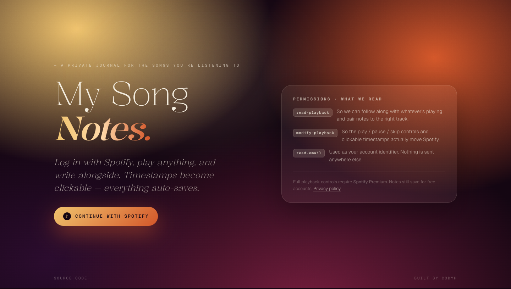

<!--
  GitHub profile README for codyhxyz/codyhxyz.
  This file goes in https://github.com/codyhxyz/codyhxyz as README.md.
--> 
# hi, i'm cody 🍋✨

*some call me a [lemonaut](https://twitter.com/lemonautzest).*

i embody these core principles:

- **🔥 aliveness-maxxer**: aliveness >>> numbness
- **☯︎ incentive-aligner**: *"show me the incentive, and I'll show you the outcome"* — Charlie Munger
- **🌐 open-sourced human**: information wants to be free. it also wants to be integrated. become part of the great collaborative experiment we call 'human civilization in the time of the internet' by open-sourcing yourself.

---

## what i'm building

### 🧠 cognitive augmentation
_humans are augmenting themselves with bespoke software, to massive effect. there has never been a better time to learn how to do augment yourself, nor more to gain. here I'm sharing some of the tools I'm using to augment myself._

- **cody's [skills](https://github.com/codyhxyz/skills)**: sharing my cognitive heuristics. these are the ways I talk to my computer.

### 🧰 stack
- **cody's [stack](https://github.com/codyhxyz/stack)**: sharing my software stack; awesome software i think more people should be aware of.

### ⚙️ my bespoke software
_here are some tools I built to solve some of my own problems. I'm sharing them below:_

  
<strong><a href="https://github.com/codyhxyz/web-annotator">Web Annotator</a></strong>: need to take notes on webpages so I don't forget why I opened it

  I believe the internet is missing an annotation layer. Leave and share notes about the web, on the web.

<strong><a href="https://github.com/codyhxyz/playlist-search-extension"> YouTube Playlist Search</a></strong>: need to add videos to the right playlists

chrome extension that adds a filter bar making 'save to playlist' actually usable for lots of playlists. also bypasses YT's 200-playlist cap, letting you search all your playlists, not just your most recent 200. Also visit <a href="https://playlist.codyh.xyz">playlist.codyh.xyz</a> for a useful save-to-playlist experience on mobile.

https://github.com/user-attachments/assets/a88daabf-a9f1-42e0-80e6-7de4250cf34c

  
<strong><a href="https://github.com/codyhxyz/webpage-summarizer">Webpage Summarizer</a></strong>: need to quickly summarize only a chunk of the page's text

  chrome extension for right-click > summarize highlighted text in your browser. built before browsers like Dia and extensions like Claude in Chrome began to normalize AI sidebars.
  
  

  

  
<strong><a href="https://github.com/codyhxyz/spotify-notes">Spotify Notes</a></strong>: need to take notes on music for DJ library curation

  take notes as you listen to songs on Spotify. live at <a href="https://songnotes.codyh.xyz">songnotes.codyh.xyz</a>.
  

#### in development

  
<strong>Manic Spending Buddy</strong>: need to stop buying things I can get for free

  Capitalism is missing an agent incentivized to help you <em>not</em> spend money. Consumers need more deflationary forces showing them how to make use of cheap of free alternatives than the new, shiny thing. Meet MSB.

  
<strong>Not A Financial Advisor (NAFA)</strong>: need to budget without paying $200/yr for YNAB

  It's 2026. Screw spending $200/yr for Reddit's darling YNAB (You Need A Budget). Meet NAFA: Not a Financial Advisor. Use a free API like Teller to fetch your transaction data, and get an LLM to build you a budget and supervise your purchasing habits. Forever Free, Open-Source Software with a first-party hosted site.

  
<strong>Dark Mode Anywhere</strong>: need dark mode on every site

  The only dark mode extension that covers 100% of the web.

  
<strong>Flur</strong>: need an affordable open-source are.na for curating my design taste

  a place for images. Curate like are.na, organize like mymind.com. Because are.na is too expensive. Open-source.

 

### 🚀 building your own bespoke software
_I've built pipelines that build pipelines. Here I'm sharing some tools I've built to remove frustrating obstacles I've encountered to building (& sharing) things:_

- **[create-claude-plugin](https://github.com/codyhxyz/create-claude-plugin)**: Nifty end-to-end scaffold for building & publishing Claude Code plugins.
- **[create-chrome-extension](https://github.com/codyhxyz/create-chrome-extension)**: Nifty end-to-end scaffold for building & publishing Chrome extensions.
- (in development) **create**: Nifty end-to-end scaffold to build, well, anything really, in a self-consistent manner across projects.

---

## currently obsessing over

- **🔌 claude plugins**: plugins are abstractions for cognitive heuristics. I'm enjoying open-sourcing the way I think. It's nice being prompted to explictly codify my heuristics, and evaluate their usefulness.
- **🧠 augmenting my cognition**: [jump to projects ↓](#-cognitive-augmentation)
- **🌱 open-sourcing myself**: currently in the process of making myself legible to the world. See my [Twitter](x.com/lemonautzest), GitHub (you're here!), and [Substack](lemonaut.substack.com) for more.

---

## bets i'm making

- **bespoke software eats app stores**; custom software development becomes a basic human need like access to reliable internet: [[1]](https://x.com/karpathy/status/2024583544157458452)
- **soon: hyper-entrepreneurial explosion!**: [[1]](https://highagency.com)
- **open-sourcing yourself is a necessary act of digital self-actualization**: [[1]](https://github.com/codyhxyz/codyhxyz/tree/main)
- **articulating to LLMs in domain-agnostic language drastically improves performance**; implementation details have never mattered less: you should spend a disproportionate amount of time elucidating WHAT you want, not HOW you want to achieve those goals.
- **LLMS are next-token prediction machines whose writing voice is fundamentally cliché and whose logic is not valid.**
---

## find me elsewhere

- 🐦 twitter: [@lemonautzest](https://twitter.com/lemonautzest)
- 🌐 site: [codyh.xyz](https://codyh.xyz)

---

*"i create because i envision that there are people out there who need the lemon zest."*
