<!--
  GitHub profile README for codyhxyz/codyhxyz.
  This file goes in https://github.com/codyhxyz/codyhxyz as README.md.
--> 
# hi, i'm cody 🍋✨

*why a lemon? on twitter I'm known as [lemonaut](https://twitter.com/lemonautzest).*

I follow the following core design principles. The list is subject to change and definitely incomplete:

- **☯︎ "show me the incentive, and I'll show you the outcome"**: — Charlie Munger. Build incentive alignment architecture and you unlock the better world.
- **🌐 information wants to be free**: — Stewart Brand. Build open-source. You have no idea how powerful of a contribution to humanity's global brain you can make this way. If you want your ideas to survive you, this is the way.
- **🏘️ live in utopia, and build what's missing.**: — my adaptation of Paul Graham's "live in the future and build what's missing". Systematically design scarcity out of your life and then share the solution, because "your problem might just be everyone else's" — [Pieter Levels, *MAKE: Bootstrapper's Handbook*](https://readmake.com/). 

---

## what i'm building

<!-- cards:start (generated by cards/build.mjs; edit cards/projects.json instead) -->
### 🧠 cognitive augmentation

_humans are augmenting themselves with bespoke software, to massive effect. there has never been a better time to learn how to do augment yourself, nor more to gain. here I'm sharing some of the tools I'm using to augment myself._

  <a href="https://github.com/codyhxyz/skills">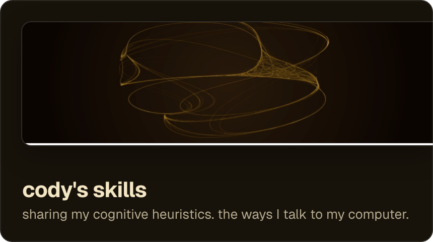</a>
  <a href="https://github.com/codyhxyz/stack">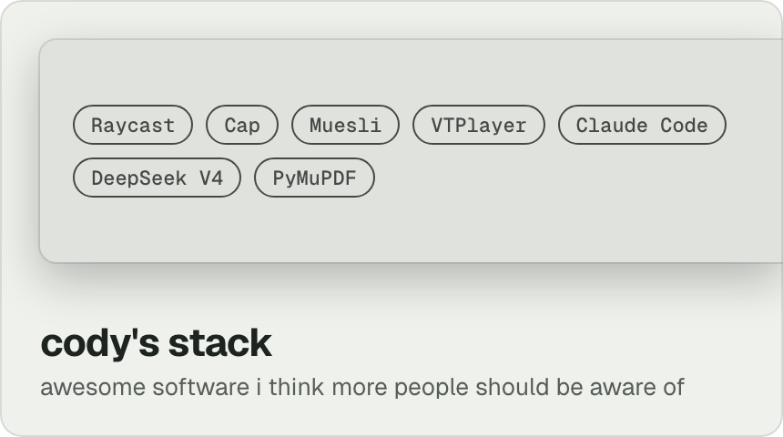</a>

### 🧪 toys & experiments

<a href="https://github.com/codyhxyz/Powder-Toy-3D">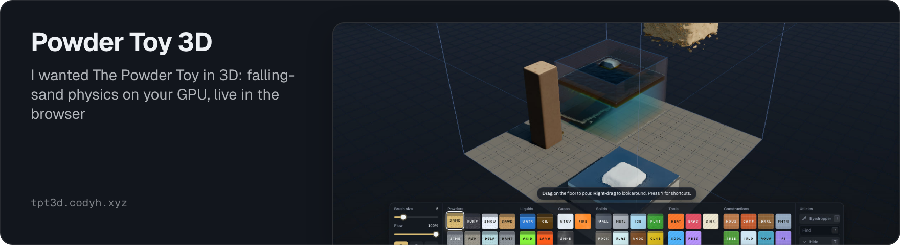</a>

<a href="https://github.com/codyhxyz/filetofish">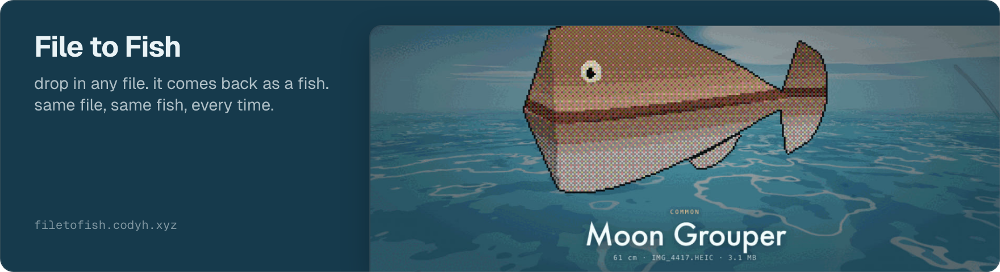</a>

  <a href="https://github.com/codyhxyz/infinite-liquid-glass">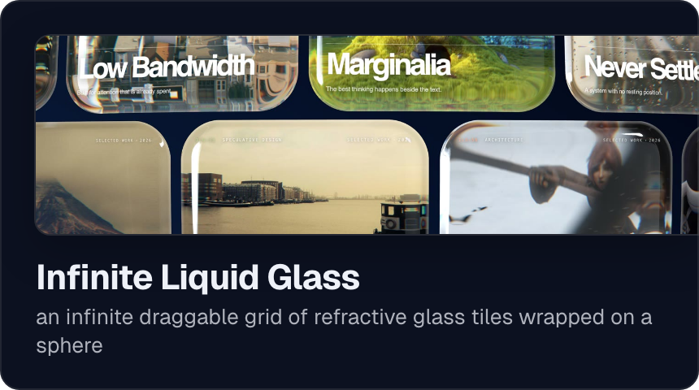</a>
  <a href="https://github.com/codyhxyz/lerping-at-home">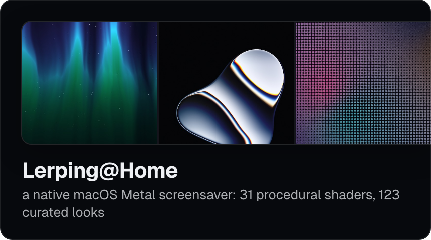</a>

<a href="https://github.com/codyhxyz/htmlincanvas-demo">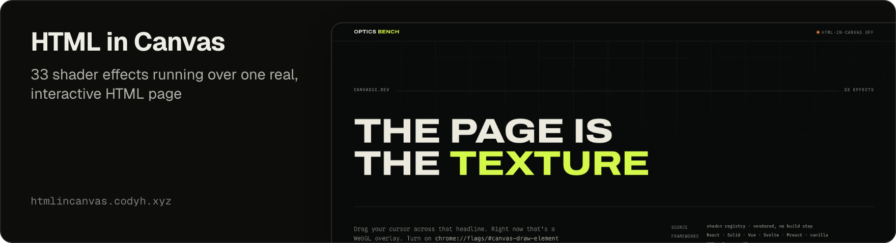</a>

### ⚙️ my bespoke software

_here are some tools I've built to solve some of my own problems. I'm sharing them below:_

- **[pi-antigravity-hud](https://github.com/codyhxyz/pi-antigravity-hud)**: live color-coded 5-hour and weekly quota meters for Antigravity models in Pi.

<a href="https://github.com/codyhxyz/playlist-search-extension">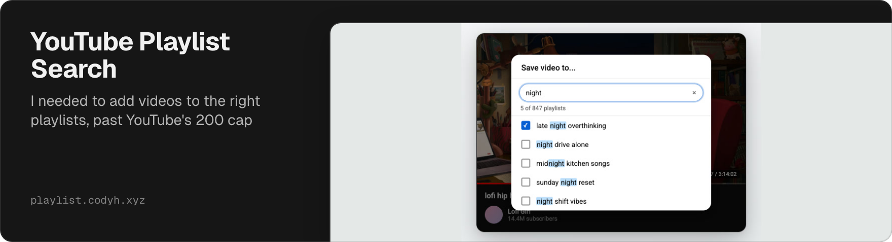</a>

<a href="https://github.com/codyhxyz/webpage-summarizer">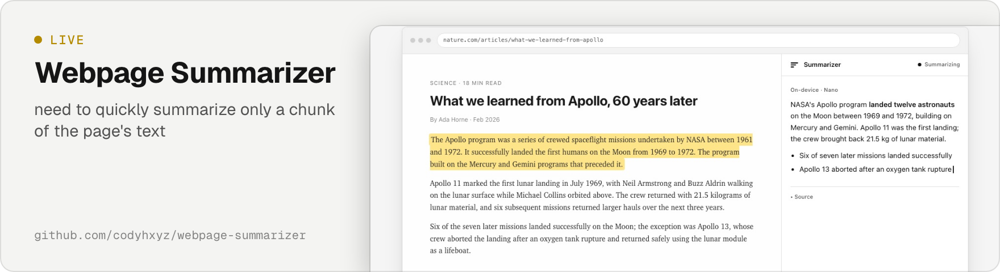</a>

#### in development

  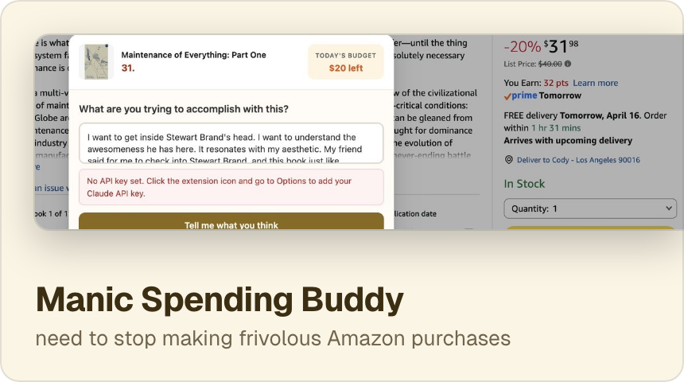
  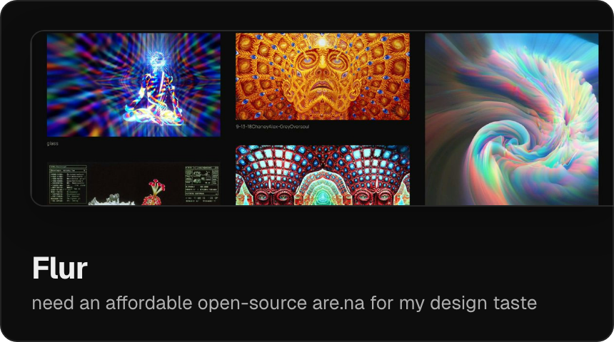

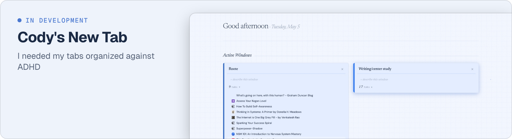

### 🚀 building your own bespoke software

_I've built pipelines that build pipelines. Here I'm sharing some tools I've built to remove frustrating obstacles I've encountered to building (& sharing) things:_

  <a href="https://github.com/codyhxyz/create-claude-plugin">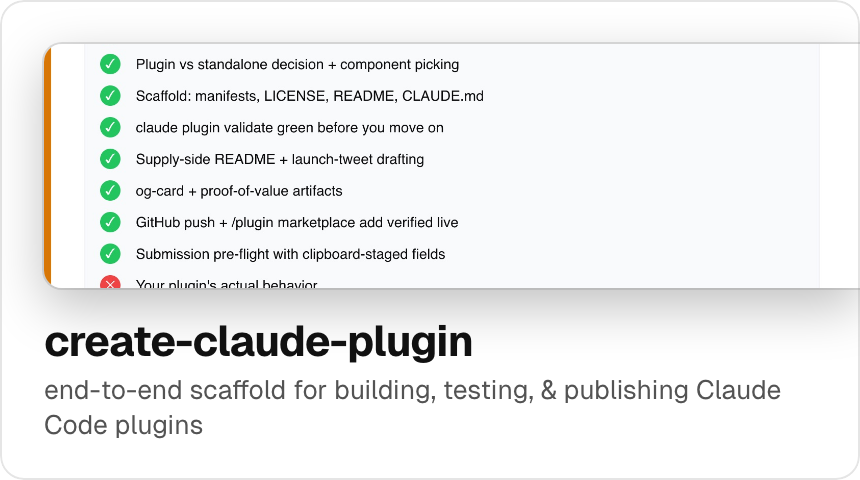</a>
  

<a href="https://github.com/codyhxyz/herdr-chrome-keys">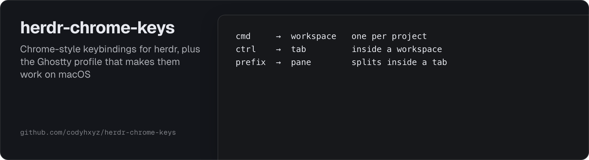</a>

<a href="https://github.com/codyhxyz/statusline">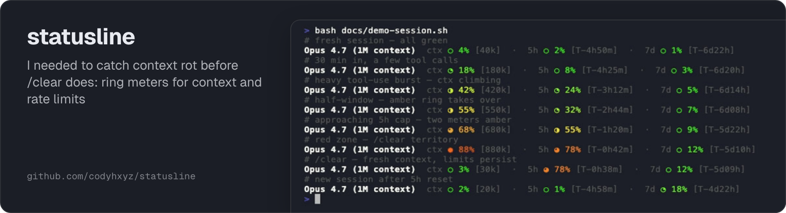</a>

<!-- cards:end -->

---

## currently obsessing over

- **🔌 claude plugins**: plugins are abstractions for cognitive heuristics. I'm enjoying open-sourcing the way I think. It's nice being prompted to explictly codify my heuristics, and evaluate their usefulness.
- **🧠 augmenting my cognition**: [jump to projects ↓](#-cognitive-augmentation)
- **🌱 open-sourcing myself**: currently in the process of making myself legible to the world. See my [Twitter](x.com/lemonautzest), GitHub (you're here!), and [Substack](lemonaut.substack.com) for more.

---

## bets i'm making

- **source code is now source conversations**: whoever makes GitHub v2 will have to catch up to this [1](https://zed.dev/blog/introducing-deltadb#source-code-is-now-source-conversation)
- **bespoke software eats app stores**; custom software development becomes a basic human need like access to reliable internet: [[1]](https://x.com/karpathy/status/2024583544157458452)
- **soon: hyper-entrepreneurial explosion!**: [[1]](https://highagency.com)
- **open-sourcing yourself is a necessary act of digital self-actualization**: what does it mean to live an examined life in the age of the internet? [[1]](https://github.com/codyhxyz/codyhxyz/tree/main)
- **don't waste time on implementation details**: spend a disproportionate amount of time elucidating WHAT you want, not HOW you want the LLM to achieve those goals.
- **one-shot or bust**: if at first you don't succeed, delete it all and prompt again (with more specificity this time). Don't waste time getting the LLM to fix the bug, rewind before you created it in the first place and try something else. 
- **Do Not Trust the Em-dash**: LLMs are next-token prediction machines who have fundamentally clichéd writing voice and fundamentally invalid logic. I am not absolutely right; it is a sycophant, and it has no idea what it's talking about. Ask it to defend one side of an argument and it will do so. Ask it to defend another side and it will do so as well. The absence of solidity is suspect. [[1]](https://x.com/karpathy/status/2037921699824607591)
- **separate planning & doing**: I worked at a startup that failed to plan before doing, and it cost us our funding round. Separate planning from doing, both for [ADHD focus](https://x.com/zetalyrae/status/1933650594964910367?s=51) and for AI output quality. spend outsized time crafting the plan.
- **organize what you create, but do it fast**: [you can't outsource your understanding to AI](https://x.com/karpathy/status/2049907410303865030). you can, however, delegate the gruntwork of manual organization. this is how i add content to my notion in 2026.
- **ai's role in writing**: can help you understand the structure of your writing, and learn grammar rules. ai should never touch voice. use the cognitive scaffolding to think bigger thoughts, not to avoid thinking entirely. let the llm rearrange your sentence, try your best never to give it power over word choice or you lose your voice.
- **generative UI as a paradigm takes off**: the current era of apps will be seen as 'one-size-fits-all' apps. the future of UI is tailored to the individual.
- **most user interfaces are poor cognitive ergonomics**: most UIs til now have been shallow facsimiles of the world models our brains generate about the very same UIs; we would do well to introspect and more closely model how our brains see software systems, rethinking UI paradigms from first principles and redesigning them to be more ideal cognitive ergonomics. For example: internet browser tabs, and the 'windows' GUI paradigm, need to be thrown out. New layers of abstraction are coming.
- **the PR and the issue are not the future of software development**: *"there are very few people internally [at GitHub] who believe that PR and the issue are the future of software development"* — GitHub, [via YouTube](https://www.youtube.com/watch?v=ClWD8OEYgp8&t=164s). the primitives of collaborative software are due for reinvention in the age of agents.
- **in a sea of slop, quality craftsmanship (taste) is the new differentiator**: [[1]](https://youtu.be/ClWD8OEYgp8?t=986)
- **thinking in bets**
---

## find me elsewhere

- 🐦 twitter: [@lemonautzest](https://twitter.com/lemonautzest)
- 🌐 site: [codyh.xyz](https://codyh.xyz)

---

*"i create because i envision that there are people out there who need the lemon zest."*
